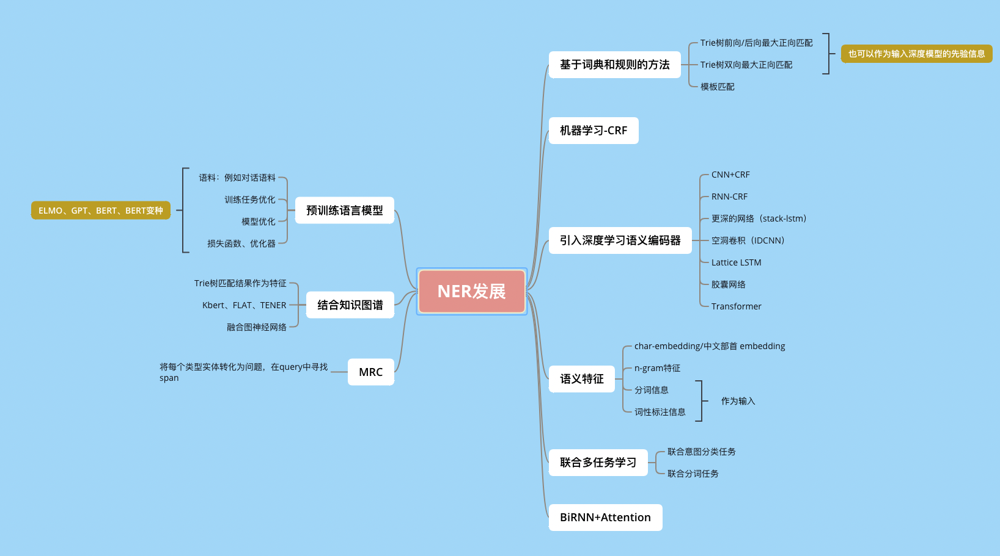
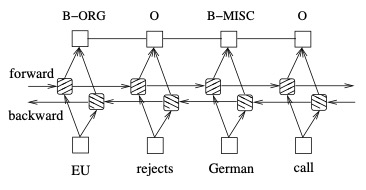
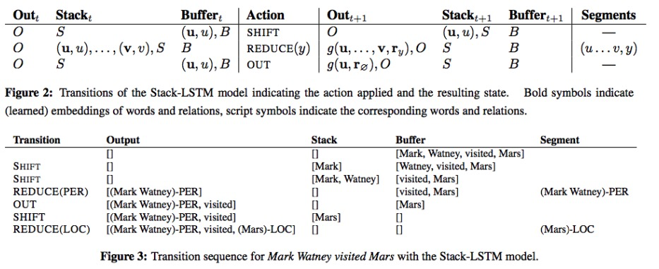
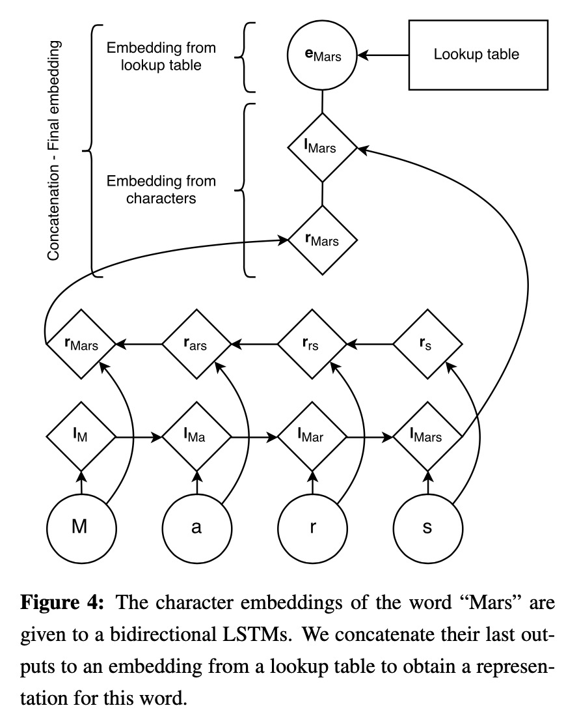
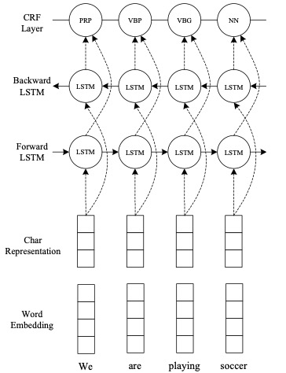
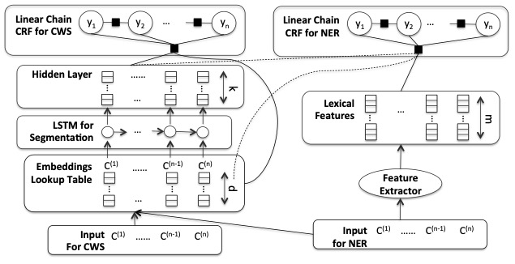
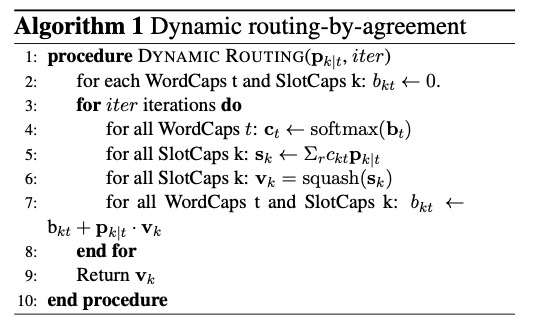
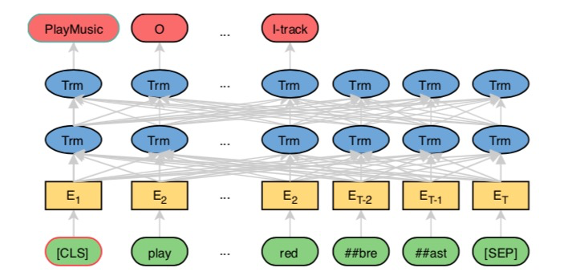
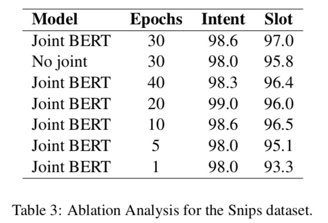
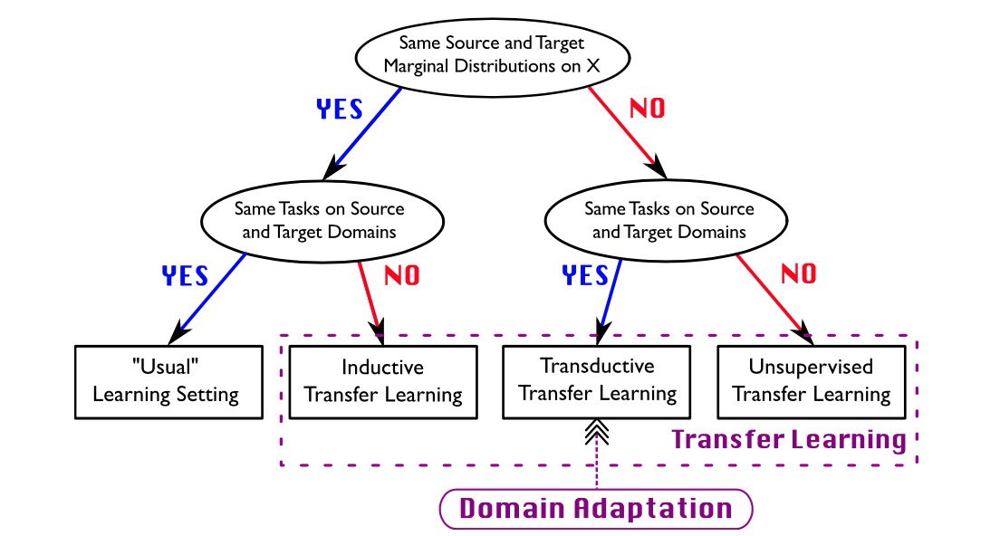

命名实体识别（NER, Named Entity Recognition），是指识别文本中具有特定意义的实体，主要包括人名、地名、机构名、专有名词等。

todo:

https://zhuanlan.zhihu.com/p/347457328

https://www.huaweicloud.com/articles/cbbd37764180a7d1bf3fbe5fab0e799b.html

# 评价指标

F1/准召率

# 方法

Sota:
https://paperswithcode.com/area/natural-language-processing/named-entity-recognition-ner

# 公开数据集

## SMP2019

对话SLU任务，包含domain, intent, slots.

## SMP2018

https://github.com/yuanxiaosc/SMP2018

## SMP2017

http://ir.hit.edu.cn/smp2017-ecdt-task1

对话意图任务，包含domain分类。

## 英文数据集

https://github.com/AtmaHou/Task-Oriented-Dialogue-Dataset-Survey

## snips&atis
英文nlu数据集，包含意图和实体，[下载](https://github.com/MiuLab/SlotGated-SLU/tree/master/data)

# 基于词典和规则的方法

## 基于词典

### 正向最大匹配

参考：[ner_rule.py](https://github.com/InsaneLife/MyPicture/blob/master/NER/ner_rule.py)

## 基于模板

# BI-LSTM + CRF

> [Bidirectional LSTM-CRF Models for Sequence Tagging](https://arxiv.org/abs/1508.01991v1)

BI-LSTM-CRF 模型可以有效地利用过去和未来的输入特征。借助 CRF 层, 它还可以使用句子级别的标记信息。BI-LSTM-CRF 模型在POS（词性标注），chunking（语义组块标注）和 NER（命名实体识别）数据集上取得了SOTA效果。同时BI-LSTM-CRF模型是健壮的，相比之前模型对词嵌入依赖更小。

> 对比了5种模型：LSTM、BI-LSTM、CRF、LSTM-CRF、BI-LSTM-CRF，LSTM: 通过输入门，遗忘门和输出门实现记忆单元，能够有效利用上文的输入特征。BI-LSTM：可以获取时间步的上下文输入特征。CRF: 使用功能句子级标签信息，精度高。

此后一些方法改进。

## stack-LSTM & char-embedding

> [Neural Architectures for Named Entity Recognition](https://arxiv.org/abs/1603.01360)

**stack-LSTM** ：stack-LSTM 直接构建多词的命名实体。Stack-LSTM 在 LSTM 中加入一个栈指针。模型包含chunking和

1. 堆栈包含三个：output(输出栈/已完成的部分)，stack(暂存栈/临时部分)，buffer (尚未处理的单词栈)
2. 三种操作（action）：
   1. SHIFT: 将一个单词从 buffer 中移动到 stack 中；
   2. OUT: 将一个单词从 buffer 中移动到 output 中；
   3. REDUCE: 将 stack 中的单词全部弹出，组成一个块，用标签y对其进行标记， 并将其push到output中。
3. 模型训练中获取每一步的action的条件概率分布，标签是真实每一步 action 的概率分布。预测时候，同坐预测每一步action概率，用概率最大action来执行action操作。
4. 在REDUCE操作输出chunking块之后，通过lstm对其编码输出chunk的向量表达，然后预测其标签。

举例见图示：

> stack-LSTM来源于：[Transition-based dependency parsing with stack long-short-term memory](http://www.oalib.com/paper/4074644)

同时使用初始化的char-embedding，对于每一个词语，通过BI-LSTM将字符编码作为输入，输出词语的字符级别表达，然后concat词向量输入到BI-LSTM + CRF。

char-embedding：

## CNN + BI-LSTM + CRF

> [End-to-end Sequence Labeling via Bi-directional LSTM- CNNs-CRF](https://www.aclweb.org/anthology/P16-1101.pdf)

- 通过CNN获取字符级的词表示。CNN是一个非常有效的方式去抽取词的形态信息（例如词的前缀和后缀）进行编码的方法，如图。

- 然后将CNN的字符级编码向量和词级别向量concat，输入到BI-LSTM + CRF网络中，后面和上一个方法类似。整体网络结构：

  

## Radical-Level Features(中文部首)

> [Character-Based LSTM-CRF with Radical-LevelFeatures for Chinese Named Entity Recognition](http://www.nlpr.ia.ac.cn/cip/ZongPublications/2016/13董传海Character-Based%20LSTM-CRF%20with%20Radical-Level%20Features%20for%20Chinese%20Named%20Entity%20Recognition.pdf).

也是一种char embedding方法，将每个中文字拆分为各个部首，例如“朝”会被拆分为字符：十、日、十、月。后面结构都类似。

## n-gram prefixes and suffixes

> [Named Entity Recognition with Character-Level Models](https://nlp.stanford.edu/manning/papers/conll-ner.pdf)

提取每个词语的前缀和后缀作为词语的特征，例如："aspirin"提取出3-gram的前后缀：{"asp", "rin"}.

包含两个参数：n、T。n表示n-gram size，T是阈值，表示该后缀或者前缀至少在语料库中出现过T次。

## Attending to Characters in Neural Sequence Labeling Models

> [Attending to Characters in Neural Sequence Labeling Models](https://arxiv.org/abs/1611.04361)

使用了单词或字符级别embedding组合，并在两种embedding之间使用attention机制“灵活地选取信息”，而之前模型是直接将两种embedding concat。

直接看公式，z是一个动态权重：
$$
z=\sigma\left(W_{z}^{(3)} \tanh \left(W_{z}^{(1)} x+W_{z}^{(2)} m\right)\right) \quad \tilde{x}=z \cdot x+(1-z) \cdot m
$$
并交叉熵上增加额外的loss:
$$
\widetilde{E}=E+\sum_{t=1}^{T} g_{t}\left(1-\cos \left(m^{(t)}, x_{t}\right)\right) \quad g_{t}=\left\{\begin{array}{ll}{0,} & {\text { if } w_{t}=O O V} \\ {1,} & {\text { otherwise }}\end{array}\right.
$$
非OOV单词希望m和x越相似越好。

> char-embedding学习的是所有词语之间更通用的表示，而word-embedding学习的是特特定词语信息。对于频繁出现的单词，可以直接学习出单词表示，二者也会更相似。

## 联合分词学习

> [Improving Named Entity Recognition for Chinese Social Mediawith Word Segmentation Representation Learning](https://www.aclweb.org/anthology/P16-2025)

将中文分词和 NER任务联合起来。使用预测的分割标签作为特征作为NER的输入之一，为NER系统提供更丰富的边界信息。

分词语料目前是很丰富的。如果目标域数据量比较小，不妨用分词的语料作为源域，来预训练一个底层编码器，然后再在目标域数据上联合分词任务fine-tuning.

# IDCNN

> [2017Fast and Accurate Entity Recognition with Iterated Dilated Convolutions](https://arxiv.org/abs/1702.02098)

针对Bi-LSTM解码速度较慢的问题，本文提出 ID-CNNs 网络来代替 Bi-LSTM，在保证和 Bi-LSTM-CRF 相 当的正确率，且带来了 14-20 倍的提速。句子级别的解码提速 8 倍相比于 Bi- LSTM-CRF。

CNN缺点：CNN 的上下文信息取决于窗口的大小，虽然不断地增加 CNN 卷积层最终也可以达到使每个 token 获取到整个输入句子作为上下文信息，但是其输出的分辨表现力太差。

于是出现了扩张卷积：对于扩张卷积，有效 输入宽度可以随着深度呈指数增长，在每层不会有分辨率损失，并且可以估计 一定数量的参数

# Chinese NER Using Lattice LSTM

> [Chinese NER Using Lattice LSTM](https://www.aclweb.org/anthology/P18-1144.pdf)

基于于LSTM-CRF模型分析了集中变种模型的优缺点：

- 基于词的LSTM-CRF：一般的pipeline是对文本进行分词之后embedding后输入深度网络预测序列中单词的类别标记。但是这样的话会受限于分词那一步的表现，也就是说如果分词过程效果不好的话，会进一步影响整个NER模型的误差。而对于NER任务中，许多词都是OOV；
- 基于字的LSTM-CRF：那么把词输入改为字输入是不是会有所改进呢？答案是肯定的。因为字向量可以完美克服上述分词过程引入的误差。但是如果单纯采用字向量的话会丢失句子中词语之间的内在信息。（当然基于该问题，学者们也提出了很多解决方案：例如利用segmentation information作为NER模型的soft features；使用multi-task learning等等）

基于上述问题，作者们提出了一种新型的Lattice LSTM：将潜在的词语信息融合到基于字模型的传统LSTM-CRF中去，而其中潜在的词语信息是通过外部词典获得的。如下所示，lattice lstm模型会在字向量的基础上额外获取词特征的信息。

# Joint model

## Slot-Gated Modeling for Joint Slot Filling and Intent Prediction

提出slot-gate方法，槽位和意图的关系建模。

### 底层特征：

使用BiLSTM结构，输入：$x = (x_1, x_2,... x_T)$，输出：$h_t = [\overrightarrow{h_t}, \overleftarrow{h_t}]$

### attention：

1. slot filling attention:

   1. 权重计算：

   $$
   c_i^S = \sum^T_{j=1} \alpha^S_{i,j} h_j,\tag{1}
   $$

$$
   \alpha^S_{i,j} = \frac{exp(e_{i,j})}{\sum_{k=1}^T exp(e_{j,k})}	\tag{2}
$$

$$
   e_{i,k} = V^T \sigma(W_{he}^S h_k + W_{ie} h_i) \tag{3}
$$

> $c_i^S \in R^{bs*T}$，和$h_j$一致。
> $e_{i,k} \in R^1$，$e_{i,k}$计算的是$h_k$和当前输入向量$h_i$之间的关系。
> 作者TensorFlow源码$W_{ke}^S h_k$用的卷积实现，而$W_{ie}^S h_i$用的线性映射_linear()。
> T是attention维度，一般和输入向量一致。

1. SF

$$
   y_i^S = softmax(W_{hy}^S (h_i+c_i^S)) \tag{4}
$$

1. Intent Prediction:其输入时BiLSTM的最后一个单元的输出$h^T$以及其对应的context向量，c的计算方式和slot filling的一致，相当于其i=T。
   $$
   y^I = softmax(W_{hy}^I (h_T+c^I)) \tag{5}
   $$

Attention具体细节见：[Attention-Based Recurrent Neural Network Models for Joint Intent Detection and Slot Filling](https://blog.csdn.net/shine19930820/article/details/83052232)

### slot-Gate:

利用意图上下文向量来建模槽意图关系，以提高槽填充性能。如图3：

1. 槽位的context向量和意图的context向量组合通过门结构(其中v和W都是可训练的)：
   $$
   g = \sum v \cdot tanh(c_i^S + W \cdot c^I)
   $$

   > $c^I,c_i^S, v \in R^{d}$,d是输入向量h的维度。
   >
   > $g_i \in R^1$，获得$c^I$的权重。
   >
   > 论文源码使用的是：$g = \sum v \cdot tanh(c_i^S + W \cdot (c^I+finsalState^I)) $

2. 用g作为预测$y_i^S$的权重向量：
   $$
   y_i^S = softmax(W_{hy}^S(h_i+c_i^S \cdot g))
   $$

a). 使用了intent和slot的attention。

b). 只使用intent的attention。

##  Joint Slot Filling and Intent Detection via Capsule Neural Networks

> [Joint Slot Filling and Intent Detection via Capsule Neural Networks](https://arxiv.org/abs/1812.09471)
>
> [Git: Capsule-NLU](https://github.com/czhang99/Capsule-NLU)

NLU中两个重要的任务，Intent detection和slot filling，当前的无论pipline或者联合训练的方法，没有显示地对字、槽位、意图三者之间的层次关系建模。

本文提出将[胶囊网络](https://blog.csdn.net/shine19930820/article/details/88959982)和dynamic routing-by-agreement应用于slot filling和intent detection联合任务.

1. 使用层次话的胶囊网络来封装字、槽位、意图之间的层次关系。
2. 提出rerouting的动态路由方案建模slot filling。

网络分为WordCaps、SlotCaps、IntentCaps。胶囊网络原理参考：[Dynamic Routing Between Capsules](http://papers.nips.cc/paper/6975-dynamic-routing-between-capsules.pdf)

### WordCaps

对于输入$x = (w_1, w_2, ..., w_T)$，输入BI-LSTM编码成为T个胶囊向量$h_t=[\overrightarrow{h_t}, \overleftarrow{h_t}]$，和普通BI-LSTM并无区别：
$$
\overrightarrow{h_t} = LSTM_{forward}(w_t, \overrightarrow{h_{t-1}}) \\
\overleftarrow{h_t} = LSTM_{backward}(w_t, \overleftarrow{h_{t-1}})
$$

### SlotCaps

这里有k个slotCaps，对应k个ner的标签。作者利用第t个wordCap对于第k个slotCap的动态路由权重$c_{kt}$作为第t个字的ner预测标签的概率。初始向量：
$$
\mathbf{p}_{k | t}=\sigma\left(\mathbf{W}_{k} \mathbf{h}_{t}^{T}+\mathbf{b}_{k}\right)
$$
通过动态路由算法，更新权重：

输出胶囊向量：
$$
\mathbf{v}_{k}=\operatorname{squash}\left(\mathbf{s}_{k}\right)=\frac{\left\|\mathbf{s}_{k}\right\|^{2}}{1+\left\|\mathbf{s}_{k}\right\|^{2}} \frac{\mathbf{s}_{k}}{\left\|\mathbf{s}_{k}\right\|}
$$
最终slot filling的损失为：
$$
\hat{y}_{t}^{k} = {argmax}_{k \in K}(c_{kt}) \\
\mathcal{L}_{s l o t}=-\sum_{t} \sum_{k} y_{t}^{k} \log \left(\hat{y}_{t}^{k}\right)
$$

### IntentCaps

输入是slotCaps的输出胶囊向量，第k个slotCap对第l个intentCap的表达向量：
$$
\mathbf{q}_{l | k}=\sigma\left(\mathbf{W}_{l} \mathbf{v}_{k}^{T}+b_{l}\right)
$$
同样通过动态路由算法获得输出胶囊向量，向量的模作为属于l类的概率：
$$
u_l = DYNAMIC \ ROUTING(q_{l|k, iter_{intent}})
$$
损失使用了max-margin Loss：
$$
\begin{aligned} \mathcal{L}_{\text {intent}} &=\sum_{l=1}^{L}\left\{\mathbb{I} z=z_{l}\left\|\cdot \max \left(0, m^{+}-\left\|\mathbf{u}_{l}\right\|\right)^{2}\right.\right.\\ &\left. +\lambda \mathbb{I} z \neq z_{l} \mathbb{U} \cdot \max \left(0,\left\|\mathbf{u}_{l}\right\|-m^{-}\right)^{2}\right\} \end{aligned}
$$

### Re-Routing

为了将Intent的信息提供给NER使用，提出了Re-Routing机制，它和动态路由机制很像，唯一改动在于权重更新中同时使用了$v_k, \hat{u_{\hat{z}}}$，其中$\hat{u_{\hat{z}}}$是norm值最大的胶囊向量。
$$
\mathrm{b}_{k t} \leftarrow \mathrm{b}_{k t}+\mathbf{p}_{k | t} \cdot \mathbf{v}_{k}+\alpha \cdot \mathbf{p}_{k | t}^{T} \mathbf{W}_{R R} \hat{\mathbf{u}}_{\tilde{z}}^{T}
$$

## Unsupervised Transfer Learning for Spoken Language Understanding in Intelligent Agents

如何利用无标签语料中的知识知识来提升SLU中的模型表现。ELMo + BLSTM-CRF ，2019年

## [A Stack-Propagation Framework with Token-level Intent Detection for Spoken Language Understanding](https://www.aclweb.org/anthology/D19-1214/)

## 

## BERT for Joint Intent Classification and Slot Filling

> [BERT for Joint Intent Classification and Slot Filling](https://arxiv.org/abs/1902.10909)

意图分类和槽位填充任务常常受限于人工标注数据集较少的问题，尤其对于稀疏的字或者未出现的字，随着bert作为双向的语言预训练模型提出，由于其在大量无监督数据集上训练，对于各类下有语言理解任务都有提升。本文将bert用于ner和意图分类的联合任务，在多个公开的数据集上对比当前的sota模型（slot-gated/attention-based recurrent neural network models），都有显著的提升。

### Proposed Approach

作者采用bert官方的做法，对于每一句话，会在句首添加[CLS]作为句子的向量表征，用于现下游的分类任务，句尾添加[SEP]作为断句，组成输入$x=(x_1, x_2, ...x_T)$。经过BERT编码器之后，输出向量$H=(h_1,..,h_T)$.

#### Intent classification and slot filling

使用句首[CLS]的输出$h_1$作为句子向量表征，用于意图分类，然后$h_2,...,h_T$用于slot filling的标签分类任务。作者平滑字词表示，在每个word的第一个sub-token输出向量作为其输出向量，整个sequence taging中，任务表示为：
$$
y_n^s = softmax(W^sh_n + b^s), n \in 1...N
$$
因此联合模型的优化目标为:
$$
p\left(y^{i}, y^{s} | \boldsymbol{x}\right)=p\left(y^{i} | \boldsymbol{x}\right) \prod_{n=1}^{N} p\left(y_{n}^{s} | \boldsymbol{x}\right)
$$
Conditional Random Field：同时对于slot filling任务使用了条件随机场作为上层解码器作为对比实验。

### Experiments

参数设置：使用了英文官方开源的[BERT-base (12 layers, 768 hidden states, and 12 heads)]( https://github.com/google-research/bert), 在BooksCorpus、English Wikipedia上预训练，最大字长度为50，batch size=128，Adam, lr=5e-5, dropout=0.1.

实验结果：

冲上面实验可以看出bert效果明显优于之前的模型，有显著的提升。

同时增加了额外bert实验。

上面实验表明，bert联合slot filling和intent classification相比于分别做两个任务也是有一定的提升，证明了两种任务的关联性。

> 本文主要将bert应用于联合的slu任务，以期望提升模型泛化能力。通过实验证明此观点，但是感觉更多的贡献来源于BERT。

## TNER

文章分析了Transformer的注意力机制，发现其在方向性、相对位置、稀疏性方面不太适合NER任务。因此改进了Transformer的encdoer，更好地建模character级别的和词语级别的特征。通过引入方向感知、距离感知和un-scaled的attention，证明改造后的Transformer encoder也能够对NER任务显著提升。

embedding中加入了word embedding和character embedding，character embedding经过Transformer encoder之后，提取n-gram以及一些非连续的字符特征。

**Direction- and Distance-Aware Attention**：

作者先说明Transformer中的函数中position embedding中，计算self-attention包含了相对位置信息，但是是没有方向的，并且在经过W矩阵映射之后，相对位置信息这一特性也会消失。

所以提出计算attention权值时，将词向量与位置向量分开计算：

通过上面公式，不仅加入了相对位置信息，还有了方向的信息。

**Un-scaled Dot-Product Attention**

去掉了attention计算中的scaled，即不除以$\sqrt{d_k}$

## FLAT

将Lattice结构和Transformer相结合，解决中文会因为分词引入额外的误差，并且能够利用并行化，提升推理速度。

**Converting Lattice into Flat Structure：**如上图，通过词典匹配到的潜在词语(Lattice)

# MRC

[A Unified MRC Framework for Named Entity Recognition](https://link.zhihu.com/?target=https%3A//arxiv.org/pdf/1910.11476.pdf)

将每个类型实体转化为问题，在query中寻找span片段作为实体。难点在于如何将实体类型构造为问题。

# 预训练语言模型

预训练语言模型：ELMO、GPT、BERT、BERT优化

- 语料：对话数据训练语言模型，因为对话中包含asr错误、用户表达错误，导致和传统的文本分布不一致等问题。
- 训练任务：全词or实体mask策略。学习策略：electra通过随机15%mask，通过generator预测mask的词语，Discriminator判别词语是否是被替换过的。
- 模型：position编码的优化（相对位置编码）。
- 损失函数、优化器：

## 微改动bert

| -                        | Masking      | Type  | Data Source    | Optimizer | Vocabulary | Init Checkpoint |
| ------------------------ | ------------ | ----- | -------------- | --------- | ---------- | --------------- |
| BERTGoogle               | WordPieceNSP | base  | wiki           | AdamW     | 21,128     | Random Init     |
| BERT-wwm                 | WWM[1]       | base  | wiki           | LAMB      | ~BERT[4]   | ~BERT           |
| BERT-wwm-ext             | WWM          | base  | wiki+ext       | LAMB      | ~BERT      | ~BERT           |
| RoBERTa-wwm-ext          | WWM          | base  | wiki+ext       | AdamW     | ~BERT      | ~BERT           |
| RoBERTa-wwm-ext-large    | WWM          | large | wiki+ext       | AdamW     | ~BERT      | Random Init     |
| **`RoBERTa-large-clue`** | WordPiece    | 290M  | CLUECorpus2020 | Adam      | 8021       |                 |

## ERNIE 1.0

如何将知识(knowledge)信息融入到模型训练中，一种方式是将知识信息作为输入，成本是其他人使用的时候也要构建知识库，并且fine-tune和pre-train的知识库分布不一致，fine-tune也会出现问题。

另一种方式是将知识信息融入到训练任务中，ERNIE提出一种知识掩盖策略取代bert的mask，包含实体层面和短语级别的掩盖，实验验证了这种策略的有效性

**Basic-Level Masking**： 和bert一样，随机选取token做mask。

**Phrase-Level Masking**：会将语法中的短语做mask，例如：a series of|such as 等。

**Entity-Level Masking**：会将一些实体整个mask，主要实体包含人物、地点、组织、产品名等。

**DLM**：利用百度贴吧的对话信息训练模型。

## ERNIE 2.0

当前pre-training模型更多关注词语或者句子共现，没有很好地利用语料中词汇、句法和语义信息，例如实体、semantic closeness、discourse relations。为了更好的利用训练语料中的词汇、句法和语义信息，提出可持续学习(continual learning)的ERNIE2.0的多任务的预训练框架，并实验论证了在GLUE上效果超过BERT和XLNet

任务：

Task Embedding

## Electra

# Domain adaptation

补充论文。

- A Survey on Deep Learning for Named Entity Recognition

数据集漏标问题，出了清理数据，

有一篇论文，首先分析了漏标对于模型的影响，然后提出了一种模型的方案，来缓解这种问题，EMPIRICAL ANALYSIS OF UNLABELED ENTITY PROBLEM IN NAMED ENTITY RECOGNITION