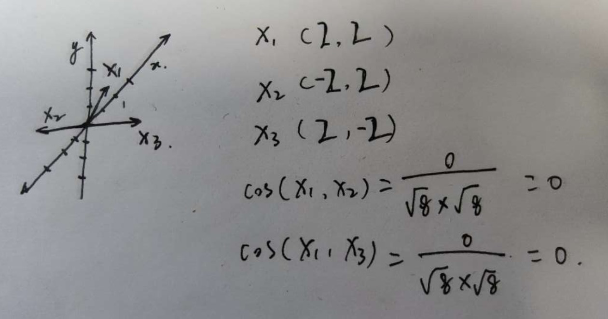
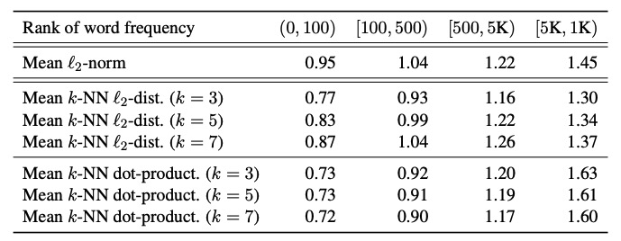
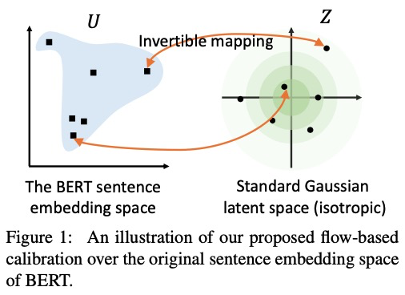

BERT在用于下游各项NLP任务上都有明显提升，但是被发现直接作为sentence embedding的预训练模型效果不好，作者发现这是因为没有很好地挖掘BERT里面的语义信息，作者从理论上证明了bert的训练目标（MLM,NSP）和相似度任务之间差异，并可视化展示。**发现bert的语义空间是非光滑的各向异性（non-smooth anisotropic）的语义空间，不利于用于语义相似任务**。那么将其转换为光滑的各向同性的高斯分布是不是就解决了呢？因此作者提出利用有监督的normalizing flows来做空间转换，并且实验证明有超过SOTA。

问题：

- BERT在检索语义相似的句子时表现不佳，是因为它带了太少的语义信息，还是没有语义信息没有充分利用？
- 如果语义信息足够，那么怎么在不额外增加监督任务下，充分利用其中信息？

# BERT句向量空间

## 语义相似度任务和BERT预训练关联

bert的掩码任务MLM，通过句子的上下文来预测被掩码的单词$x$, 其向量表示$w_x$，$h_c$是其上下文$c$经过深度网络之后的向量表示，语言模型和掩码任务都是建模上下文c条件的x分布，可以表示为：
$$
p(x \mid c)=\frac{\exp \mathbf{h}_{c}^{\top} \mathbf{w}_{x}}{\sum_{x^{\prime}} \exp \mathbf{h}_{c}^{\top} \mathbf{w}_{x^{\prime}}}
$$

[2017Breaking](http://www.researchgate.net/publication/321025432_Breaking_the_Softmax_Bottleneck_A_High-Rank_RNN_Language_Model)指出，对于一个充分训练的语言模型，$\mathbf{h}_{c}^{\top} \mathbf{w}_{x}$可以近似的表示为：
$$
\begin{aligned} \mathbf{h}_{c}^{\top} \mathbf{w}_{x} & \approx \log p^{*}(x \mid c)+\lambda_{c} \\ &=\operatorname{PMI}(x, c)+\log p(x)+\lambda_{c} \end{aligned} \\
\operatorname{PMI}(x, c)=\log \frac{p(x, c)}{p(x) p(c)}
$$
其中PMI(x,c)表示x和c之间的互信息，表征的是x和c的共现近似度，而”语义“在数学空间上的表达就是共现关系的统计表示，因此，词向量和上下文向量的点击是可以反应词语和上文问的语义相似度的。

因此，如果两个上下文$c$和$c'$和同一个词w有共现关系，那么一定程度上$c$和$c'$也是相似的，这表明BERT训练过程和语义相似度目标很接近，**训练出的句向量也包含了句子语义相似的信息**。

那么，**是否是没有有效利用BERT中的句向量信息呢？**

## 各向异性向量与语义相似性

由于cos相似度和点积，都是基于向量的基是正交的且各向同性，这种情况下的向量夹角才具有可比性，如果不同的基非正交，那么不同的基向量计算出来的向量夹角没有几何意义。例如下图中，基向量是非正交，且各向异性（基向量单位向量长度不一样），计算向量x1与x2的cos相似度为0，x1与x3的cos相似度为0，但是我们从几何角度上看，其实x1是与x3更相似的，所以导致计算相似度结果也会有问题。

同时，目前已近有[论文](https://arxiv.org/abs/1907.12009)发现BERT的向量空间是各向异性的，且词嵌入呈现锥形分布，作者也做了一些论证，为了验证BERT词向量分布是否和词频有关，通过计算不同词频的$\mathcal{l}_2$范数、词向量之间的欧式距离，如下表所示。

> 因为词向量空间和句向量空间共享的是同一个高维空间，如果词向量空间有什么问题，那句向量空间也会有同样的问题。

**词频会给词向量引入偏差**：从表中可以看出，无论是$\mathcal{l}_2$范数还是词向量之间的欧式距离，不同词频之间分布都不一致。对于$\mathcal{l}_2$范数，明显高频词语离原点更近，这会导致同意词语由于词频不同带来的语义空间的偏差，不能使用词向量距离来表示其相似性，推理到句向量也同理。

**低频词语更稀疏**：同时高频词语的词向量之间的欧式距离更小，说明高频词语更加稠密，低频词语更加稀疏，稀疏会导致语义空间的某些地带空白（holes），没有语义表示，因为bert句向量是词向量的平均池化，是一种保凸性运算，然而这些没有语义定义的空间使得分布不是凸性的，所以可以认为BERT句向量上是**语义不平滑的(semantically non-smoothing)**，这导致句向量相似度不一定准确表示句子的语义相似度。

# BERT-flow

为了解决bert语义不平滑问题，作者通过Normalizing Flows来讲bert句向量分布转换到一个光滑的、各向同性的高斯分布。

为什么要转换为高斯分布呢，标准高斯分布是各向同性的，同时标准高斯分布是凸的，或者说是没有"holes"，因此语义分布更为光滑。

## Flow-based Generative Model

A flow-based generative model会将潜在空间$\mathcal{Z}$到观测空间$\mathcal{U}$的可逆变换 ，生成过程为:
$$
\mathbf{z} \sim p_{\mathcal{Z}}(\mathbf{z}), \mathbf{u}=f_{\phi}(\mathbf{z})
$$
其中$ p_{\mathcal{Z}}$是标准的高斯分布，$\mathcal{U}$是bert的分布，

# Reference

- 论文：[https://arxiv.org/pdf/2011.05864.pdf](https://arxiv.org/pdf/2011.05864.pdf)
- 代码：[https://arxiv.org/pdf/2011.05864.pdf](https://arxiv.org/pdf/2011.05864.pdf)

- https://kexue.fm/archives/8069

