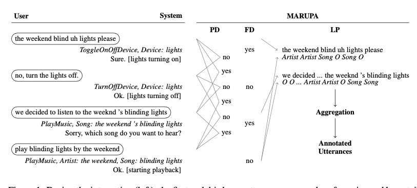

# query聚类

## Context-Aware Query Suggestion by Mining Click-Through and Session Data

1. query聚类：将query通过点击二部图计算距离，然后进行聚类，解决稀疏性问题。基于假设：如果两个query很相似，那么他们的点击URL分布也会很相似，所以通过query的点击url的分布来表示query。

$$
\overrightarrow{q_{i}}[j]=\left\{\begin{array}{ll}\text { norm }\left(w_{i j}\right) & \text { if edge } e_{i j} \text { exists; } \\ 0 & \text { otherwise }\end{array}\right.
$$

> 其中边的权重$w_{ij}$为$query_i$到$\text{url}_i$的点击次数。如果一个query经常呗搜索，一个不经常被搜索，即使他们分布相似，但他们之间的点击次数会相差很大，为了消除这一影响，对于w会做一个平滑：
> $$
> \operatorname{norm}\left(w_{i j}\right)=\frac{w_{i j}}{\sqrt{\sum_{\forall e_{i k}} w_{i k}^{2}}}
> $$
> 

聚类距离计算：
$$
\operatorname{distance}\left(q_{i}, q_{j}\right)=\sqrt{\sum_{u_{k} \in U}\left(\overrightarrow{q_{i}}[k]-\overrightarrow{q_{j}}[k]\right)^{2}} \tag{2}
$$

> 同时，聚类需要query两两计算距离，真实情况下query会十分多，这样计算效率低下，十分耗时。另外，聚类的个数也是未知的。而且不同的url作为query的表示向量，会十分巨大且稀疏。最后日志也是增量变化，类簇也需要逐步更新。

聚类算法：

对于每个类簇C也会用向量表示：
$$
\vec{c}=\operatorname{norm}\left(\frac{\sum_{q_{i} \in C} \overrightarrow{q_{i}}}{|C|}\right)
$$
然后query和C计算距离使用公式2. 同时用直径D度量来评价簇的紧密性:
$$
D=\sqrt{\frac{\sum_{i=1}^{|C|} \sum_{j=1}^{|C|}\left(\overrightarrow{q_{i}}-\overrightarrow{q_{j}}\right)^{2}}{|C|(|C|-1)}}
$$

> 会设置一个$D_{max}$，每个C的直径D都不能超过$D_{max}$。

> 同时，由于URL非常多，会造成表达矩阵维度过大，并且十分稀疏（query的平均度只有8.2，url只有1.8）。因此在寻找和q最相近的C的时候，找寻的类簇C必须要和q有过共享的url，即有过一条边（这里感觉还可以优化）

因此提出了dimension array data structure。

同时边的连接仍然会很多，作者认为其中一些权重较小的边可能会是潜在的噪声（用户随机点击），可以对其进行修剪来减少计算量。设定$w_{ij}$为$q_i$对于$utl_j$的权重（点击了多少次），那么$w_i = \sum_j w_{ij}$，会设置一个绝对权重和相对权重的阈值来做过滤，文中设定的绝对阈值5相对阈值0.1。

**query推荐**：通过用户的历史查询构建session，并将query用其类簇c表示，构建后缀树来做推荐。

在对话领域，对于未知类别功能的query，可以使用此方法来对query做粗粒度聚类，然后类簇的内部在做一个细粒度的拆分，例如训练一个相似度模型来做区分。

# query 改写
## Learning to Attend, Copy, and Generate for Session-Based Qery Suggestion

> 假设：用户说的话未被理解正确，通常会换个说法再说一遍。
>
> 那么如何来挖掘出这种改写呢？

将用户历史query构建为session，通过seq2seq模型来对语义建模，生成推荐的query。

训练目标：1. 生成的损失：每个token预测和标签的交叉熵。2. copy的损失，和生成的损失类似

> 有用户错误、asr错误，通过这种seq2seq的模型，学习session中的语言模型，能够对其中一些错误进行纠正，获得正确的query改写。

## Feedback-Based Self-Learning in Large-Scale Conversational AI Agents

假设：用户执行query失败之后，部分人还会继续尝试：1）更清晰准确地说话。2）换一种说法（复述）。3）换意图or放弃。

通过sf表征query，通过会话中的sf构建会话图，建立转移概率句子，利用消融马尔科夫，并统计每个sf的成功率，来对query进行改写。

定义状态：

- final state. 不可能转移到其他系统状态，可以从其他任何状态转移过来。
- absorbing states。=成功 or 失败。系统通过系列用户行为判断，例如用户说”stop“或者没有理解，会变成失败状态。如果用户说听歌，播放歌曲之后持续停了一段时间，就是成功状态。

> 每个h之间的转移概率来源于用户日志，每个h的成功率来自于统计的平均成功率。
>
> 这里判断一个query成功是否成功也需要一套指标体系，本文没有详细说明。

## Leveraging User Paraphrasing Behavior In Dialog Systems To Automatically Collect Annotations For Long-Tail Utterances

用户用各种各样的替代query来表达相同的请求，这些query可以是一些长尾低频的表达。同时当用户的话没有被系统理解的时候，用户也会提供隐式的反馈，比如换一句话。文章提出了MARUPA方法，利用用户反馈标注，自动进行用户摩擦检测。

包含三个模块:

- PD: 复述检测。
- FD：用户摩擦检测
- LP：标签映射。

## A Scalable Framework for Learning From Implicit User Feedback to Improve Natural Language Understanding in Large-Scale Conversational AI Systems

怎么从用户交互和对话历史的丰富信息中挖掘出用户是否满意，标注出意图。本文提出一个领域无关的框架，通过从日志数据中产生新的标注数据提升NLU的效果。

框架：

对于输入query的日志：

- DIM模块检测是否存在缺陷，或者不满足用户。
- 对于高置信度存在缺陷的query，通过DCM模型给其标注一个更优的SF。
- 通过这些更正SF的query+原有训练数据 再来重新训练NLU模型，提升效果。

### Model 

DIM和DCM模型都是下图，输出包含三部分。1）query。2）SF，包含domain、intent、slot、得分等、3）一些手工提取的特征，

- 对于DIM模型，预估的是是否存在缺陷。
- 对于DMC会额外输入一个候选domain/intent的特征，预估的是是否当前候选domain/intent是一个正确的label

# 语言模型

## Style Attuned Pre-training and Parameter Efficient Fine-tuning for Spoken Language Understanding

- 利用预训练的语言模型减少模型对数据的依赖，更少的数据进行领域适配。提出conversational language modeling (CLM) pre-training task :利用历史会话作为语料训练，并

  

- light encoder architecture：不同领域使用共享的CLM，下游接入一个light encoder，提高效率

## PRE-TRAINING FOR QUERY REWRITING IN A SPOKEN LANGUAGE UNDERSTANDING SYSTEM

- 提出一个 neural-retrieval based approach for query rewriting
- 利用预训练语言模型弥补训练语料不足的问题。基于用户的历史会话和隐式反馈训练语言模型。
- 同时结合nlu任务一起作为正则化进行训练。

**Query Rewrite**

- 通过encoder将query转换为向量。结构如下图，同时引入了预训练模型（预测会话下一句任务）和联合nlu任务训练，（数据中删除不满意的）

- 通过faiss召回top-k近邻的query。

# 自动服务满意度打标

## IQ-Net: A DNN Model for Estimating Interaction-level Dialogue Quality with Conversational Agents

之前手工提取的一些特征来评估会话质量，但是面对多域难以迁移。通过历史会话来评估当前的会话服务满意度，主要解决的问题：

模型结构，其中融入了tts来评估服务满意度：

模型函数，预测$U_t$的是否存在缺陷：
$$
p\left(\text { Defect }=\operatorname{true} \mid<U_{t}, R_{t}, U_{t+1}>, f_{M}\right)
$$
其中$f_m$表示meta-data features，这些特征包括：

实验结果，其中baseline使用了GBDT模型：

## Large-scale Hybrid Approach for Predicting User Satisfaction with Conversational Agents

评估会话的用户满意度十分重要，目前通过人工标注方法搜集输出，然后评估或者训练模型，这类方法依赖人工标注，域增加难以扩展，一种方式是收集用户的直接反馈，来训练模型。但是对于某些意图和场景可能不太适合（哪些领域呢？）因此本文提出一种hybrid approach将**用户显式反馈**和**用户满意度预测模型（一个基于用户反馈数据训练，另一个基于人类注释数据）**推断的用户满意度预测，能能够减少对人工标注的依赖。

> 对于那些意图和场景可能不太适合直接问用户呢？例如用户主动打断tts或者终止会话，询问会很不自然，这时候使用用户满意度预测模型就能够排上用处。

显示反馈的举例：

整个方法的流程：

模型的结构：

# 对话交互
上述各种显示反馈和显示反馈都有提及，但是具体怎么来做显示反馈，比如怎么从交互上更好的让用户更好的和你交流、用户反馈需要注意些什么呢？
